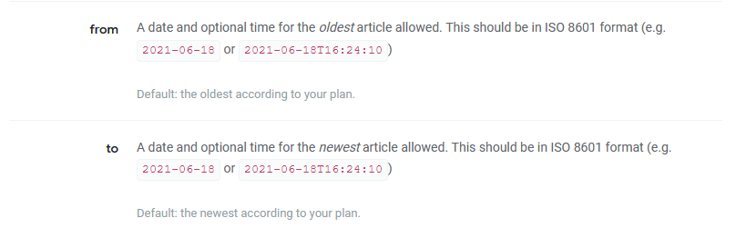

```{r setup, include=FALSE}
knitr::opts_chunk$set(echo = FALSE, cache = TRUE)
```

## Goals

- Understand very basics of APIs 

- Contact an API using R

- Process returned data

- Create a word cloud

## APIs

Application Programming Interfaces (APIs) - a defined method for asking for information from a computer  

- [List of APIs](https://www.programmableweb.com/apis/directory)

- Important for grabbing data, often returned in JSON format

- Expand opportunities by allowing your students to get data they are interested in!

> - Very few packages for contacting APIs are out there for R (as compared to say python) 

> - Can do it yourself using `httr` package!  


## Steps to obtain data 

- Install packages needed for contacting APIs and handling data  

    + `httr` and `jsonlite`  
    
- (Usually) Obtain a key by registering at the API you want to contact  

- Construct a **URL** to obtain data (using `GET()`)

- Process data using `jsonlite` functions  


## Example https://newsapi.org/ 

Registered for a key at [newsapi.org](https://newsapi.org/). An API for looking at news articles  

- Look at documentation for API (most have this!)  

- Example URL to obtain data is given  

`https://newsapi.org/v2/everything?q=bitcoin&apiKey=myKeyGoesHere`


## Example https://newsapi.org/ 

- Can add in date for instance:

```{r, fig.align='center', out.width="75%"}

```

`https://newsapi.org/v2/everything?q=bitcoin&from=2021-06-01&apiKey=myKeyGoesHere`


## Using R to Obtain the Data

- Use `GET` from `httr` package (make sure to load package!)  

- Modify for what you have interest in!  

```{r, echo = TRUE, eval = FALSE}
library(httr)
GET("http://newsapi.org/v2/everything?qlnTitle=Juneteenth&from=2021-06-01&language=en&
    apiKey=myKeyGoesHere")
```

```{r, echo = FALSE}
library(httr)
myData <- GET("http://newsapi.org/v2/everything?qInTitle=Juneteenth&from=2021-06-01&language=en&pageSize=100&apiKey=aa4b545bfbd64d4bb22ba0cb9f78189c")
```

## Returned data 

- Usually what you want is stored in something like `content`

```{r, echo = TRUE}
str(myData, max.level = 1)
```

## Parse with `jsonlite`

Common steps:

- Grab the list element we want  
- Convert it to characters (it will have a JSON structure)  
- Convert it to a data frame with `fromJSON` from the `jsonlite` package  

```{r, echo = TRUE, message = FALSE}
library(dplyr)
library(jsonlite)
parsed <- myData$content %>% rawToChar() %>% fromJSON()
str(parsed, max.level = 1)
```

## Inspecting article info

```{r, echo = TRUE}
parsed$articles %>% 
  select(author, source, title, description, everything())
```


## Building a word cloud

Use data from titles and visualize in a word cloud  

- Must 'tokenize' the titles and remove 'stop words' like "the" or "a"  

- `dplyr` and `tidytext` packages makes this very easy!

> - `unnest_tokens()` tokenizes the titles and creates a data frame  

> - A `stop_words` object is available with common words to remove (sometimes you need to add to this)  

> - `anti_join()` the data frame from `unnest_tokens()` and the `stop_words` data frame  

> - Sum up the number of times each word appears for weighting in the word cloud (`count()` works well!)


## Making data for word cloud  

```{r, echo = TRUE,  message = FALSE}
library(dplyr); library(tidytext)
wcData <- parsed$articles$title %>% 
  as_tibble() %>% 
  unnest_tokens(word, value) %>% 
  anti_join(stop_words) %>% 
  count(word, sort = TRUE)
wcData
```

## Word cloud via `wordcloud2` package  

`wordcloud2` package easily creates nice looking word clouds  

<center>
```{r, echo = TRUE}
library(wordcloud2); wordcloud2(wcData[-1,])
```
</center>

## Goals

- Understand very basics of APIs 

- Contact an API using R

    + `httr:GET("URL")`

- Process returned data 

    + Often JSON data: `jsonlite` package  
    + Tokenize and remove stop words with `tidytext`  

- Create a word cloud

    + `wordcloud2` package


